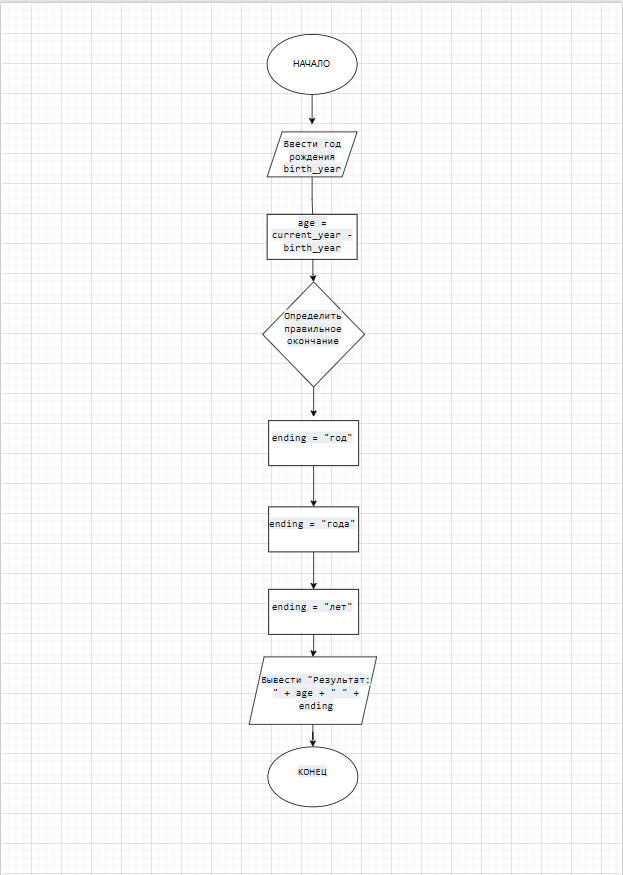

# Домашнее задание к работе 6

## Условие задачи
Написать программу, которая на основе введенного года рождения вычисляет полный возраст в годах и выводит результат в текстовой форме. (Например: 5 лет, 21 год).

## 1. Алгоритм и блок-схема

### Алгоритм
1. **Начало**
2.    current_year = получить_текущий_год()
    
3.    ВЫВЕСТИ "Введите год рождения: "
4.    birth_year = ВВОД_ЧИСЛА()
    
5.    age = current_year - birth_year
    
6.    ЕСЛИ (age % 10 == 1) И (age % 100 != 11) ТО
7.        ending = "год"
8.    ИНАЧЕ_ЕСЛИ (age % 10 >= 2) И (age % 10 <= 4) И 
9.              ((age % 100 < 10) ИЛИ (age % 100 >= 20)) ТО
10.        ending = "года"
11.    ИНАЧЕ
12.        ending = "лет"
13.    КОНЕЦ_ЕСЛИ
    
14.    ВЫВЕСТИ "Результат: " + age + " " + ending
15. **Конец**

### Блок-схема
 

## 2. Реализация программы

#include <stdio.h>
#include <time.h>

int main() 
{
    int birth_year, current_year, age;
    current_year = 2025;
    
    printf("Введите год рождения: ");
    scanf("%d", &birth_year);
    
    {

    age = current_year - birth_year;
    

    printf("Результат: %d ", age);
    
    if (age % 10 == 1 && age % 100 != 11) {
        printf("год\n");
    } else if (age % 10 >= 2 && age % 10 <= 4 && 
               (age % 100 < 10 || age % 100 >= 20)) {
        printf("года\n");
    } else printf("лет\n");
    }
    
    return 0;
}

## 3. Результаты работы программы

Введите год рождения: 1965
Результат: 60 лет

## 4. Информация о разработчике

Ищенко Иван бИЦ-252
